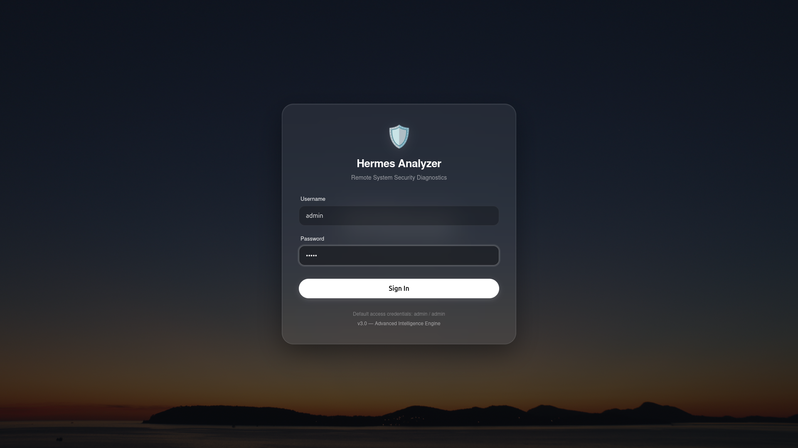
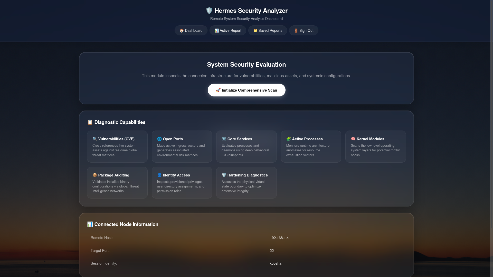
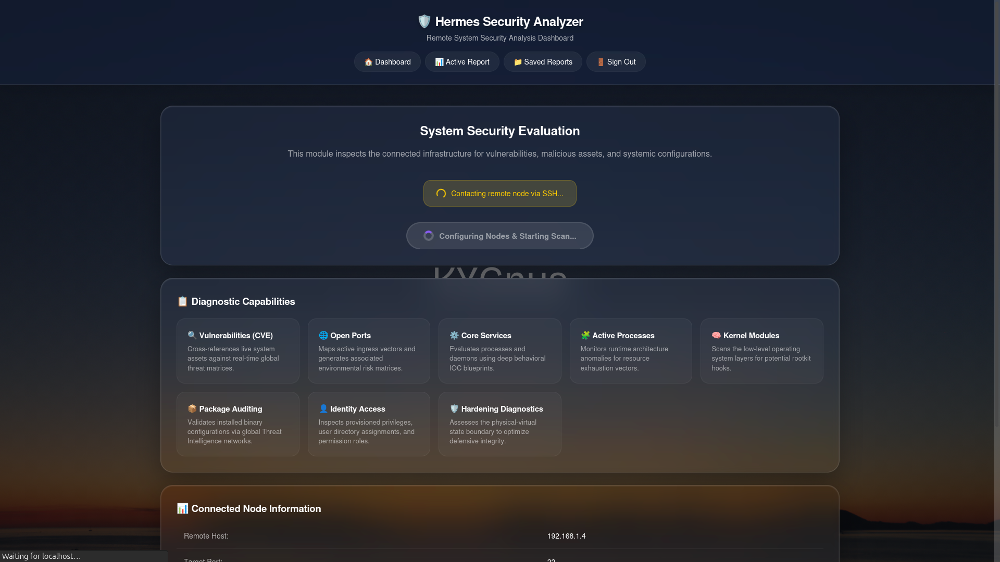
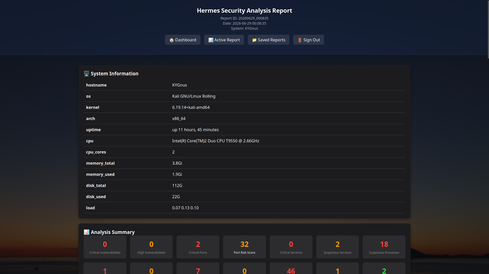
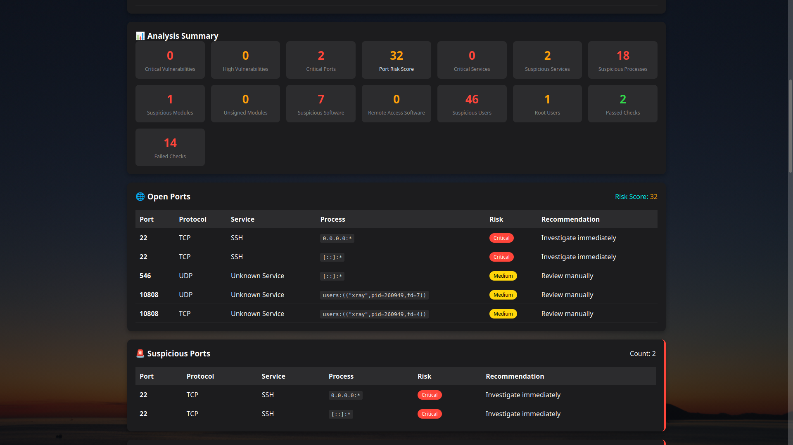
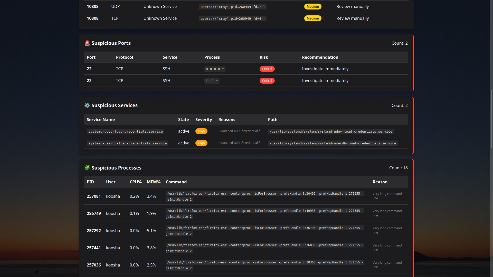
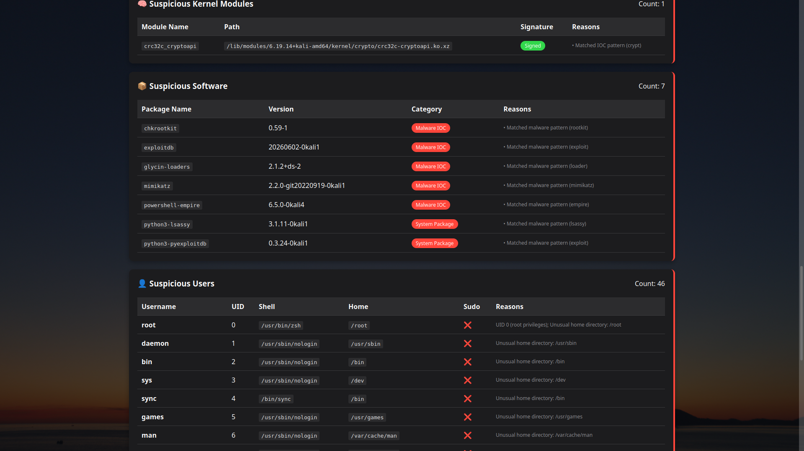
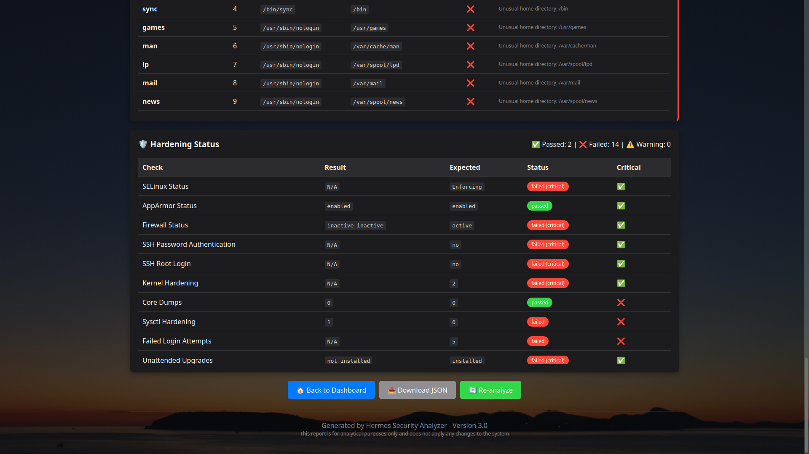
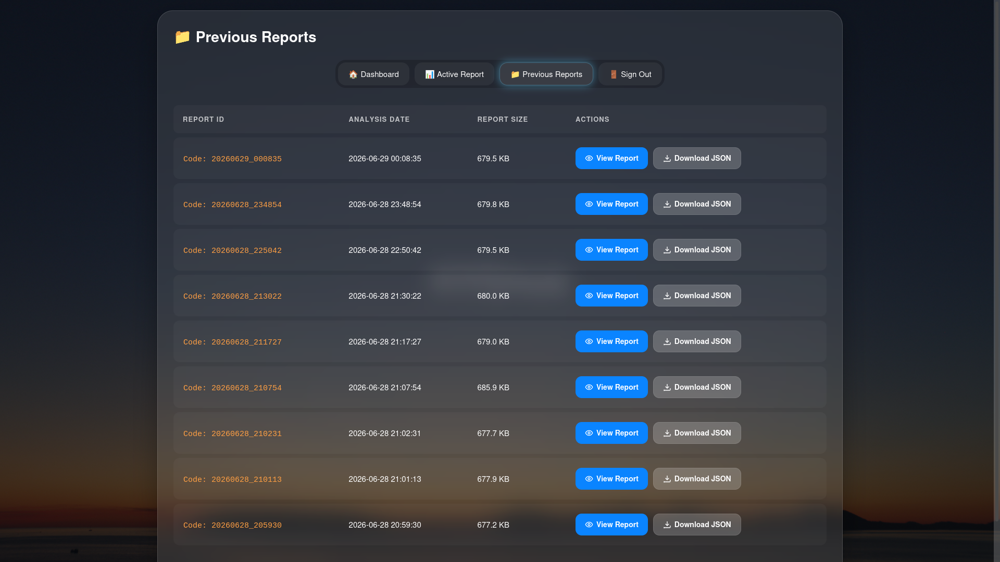

# Hermes Security Analyzer

**A Comprehensive Remote System Security Analysis Platform**

<div align="center">
  
  
  
  <br/>
  
  
  
  <br/>
  
  
  
</div>

## 🚀 Overview

**Hermes Security Analyzer** is a powerful Flask-based web application designed for comprehensive remote Linux system security analysis. It performs deep security assessments without making any modifications to the target systems, making it ideal for security audits, incident response, and compliance assessments.

### Key Features
- **Read-Only Analysis**: Performs deep security analysis without changing the target system
- **Comprehensive Scanning**: 8 different security analysis modules
- **Detailed Reports**: Professional HTML reports with visual analytics
- **Cross-Platform**: Works from both Linux and Windows environments
- **No Agent Required**: Uses SSH for remote analysis

## ✨ Features

### Core Analysis Capabilities

| Feature | Description |
|---------|-------------|
| 🔍 **Vulnerability Scanning** | CVE detection using NVD database with CVSS scoring |
| 🌐 **Port Analysis** | Comprehensive port scanning with risk scoring and threat classification |
| ⚙️ **Service Analysis** | Deep inspection of system services with IOC matching |
| 🧩 **Process Analysis** | Real-time process monitoring with anomaly detection |
| 🧠 **Kernel Module Analysis** | Rootkit detection and module integrity verification |
| 📦 **Software Audit** | Package analysis with threat intelligence matching |
| 👤 **User Analysis** | Privilege audit and suspicious account detection |
| 🛡️ **Hardening Checks** | Comprehensive security posture assessment |

### Advanced Capabilities

- **Threat Intelligence**: Real-time matching against known malware patterns
- **Risk Scoring**: Automated risk assessment for ports and services
- **Resource Monitoring**: CPU and memory abuse detection
- **Report Generation**: Professional HTML and JSON reports
- **Export Options**: Export reports in multiple formats

## 🛠️ Technical Architecture

### Built With
- **Flask**: Web framework with modern UI design
- **Paramiko**: SSH connectivity with connection pooling
- **Threading**: Concurrent analysis for performance
- **Modern UI**: Clean, responsive interface

### Architecture Overview

```
┌─────────────────────────────────────────────────────────────┐
│                    Hermes Security Analyzer                  │
├─────────────────────────────────────────────────────────────┤
│  Web Interface (Flask + Modern Design)                      │
│  ├── Dashboard                                              │
│  ├── Report Viewer                                          │
│  ├── Report Manager                                         │
│  └── Export Functions                                       │
├─────────────────────────────────────────────────────────────┤
│  Analysis Engine                                            │
│  ├── CVE Scanner (NVD Integration)                          │
│  ├── Port Scanner (ss/ netstat)                             │
│  ├── Service Analyzer (systemctl)                           │
│  ├── Process Analyzer (ps)                                  │
│  ├── Kernel Module Analyzer (lsmod/modinfo)                 │
│  ├── Package Auditor (dpkg/rpm/pacman)                     │
│  ├── User Auditor (getent/passwd)                           │
│  └── Hardening Checker                                      │
├─────────────────────────────────────────────────────────────┤
│  SSH Connection Manager                                     │
│  ├── Connection Pooling                                     │
│  ├── Keep-alive Management                                  │
│  └── Retry Logic                                            │
└─────────────────────────────────────────────────────────────┘
```

## 📋 Prerequisites

### Local Machine
- Python 3.9+
- Modern web browser
- 4GB+ RAM (8GB recommended)
- Internet connection (for CVE database updates)

### Target Linux Servers
- SSH server (port 22 or custom)
- sudo privileges for SSH user
- Linux (Ubuntu/Debian/CentOS/RHEL recommended)

## 🔧 Installation

### 1. Clone the Repository
```bash
git clone https://github.com/KooshaYeganeh/Hermes.git
cd Hermes
```

### 2. Create and Activate Virtual Environment
```bash
# Linux/MacOS
python -m venv venv
source venv/bin/activate

# Windows
python -m venv venv
venv\Scripts\activate
```

### 3. Install Dependencies
```bash
pip install -r requirements.txt
```

### 4. Configure the Application
Create `settings.py` with your configuration:

```python
# settings.py

# SSH Configuration
SSH_HOST = "192.168.1.100"  # Target server IP
SSH_PORT = 22
SSH_USERNAME = "your_username"
SSH_PASSWORD = "your_password"  # Or use SSH_KEY
SSH_KEY = None  # Set to private key path if using key auth

# Session Configuration
SESSION_TYPE = 'filesystem'
SESSION_PERMANENT = False
PERMANENT_SESSION_LIFETIME = 3600

# Paths
LOG_DIR = '/tmp/Hermes'
REPORT_DIR = os.path.join(LOG_DIR, 'reports')

# Cache Settings
CACHE_TTL = 300
CACHE_MAX_SIZE = 100
```

### 5. Start the Application
```bash
python main.py
```

Access the web interface: `http://localhost:5050`

**Default Credentials**:
- Username: `admin`
- Password: `admin` (Change immediately!)

## 📊 Usage Guide

### 1. Dashboard
The dashboard provides a comprehensive overview of your security posture:
- System information (hostname, OS, kernel, uptime)
- Security service status
- Quick actions for scanning and reporting

### 2. Running a Security Scan
1. Click **"Initialize Comprehensive Scan"**
2. Wait for the scan to complete (typically 30-60 seconds)
3. View the detailed report with all findings

### 3. Understanding the Report
The report is organized into logical sections:
- **System Information**: Hardware and OS details
- **Executive Summary**: High-level security overview
- **CVEs Found**: Vulnerabilities with severity scoring
- **Suspicious Ports**: Open ports with risk assessment
- **Suspicious Services**: Services with IOC matches
- **Suspicious Processes**: Processes with anomaly detection
- **Suspicious Kernel Modules**: Module integrity issues
- **Suspicious Packages**: Software with threat matches
- **Suspicious Users**: Privilege and account anomalies
- **Hardening Status**: Security configuration review

### 4. Exporting Reports
- **HTML Report**: Viewable in any browser
- **JSON Export**: For integration with other tools
- **Text Export**: Plain text format for documentation

## 🔒 Security Considerations

### Best Practices
1. **Authentication**: Change default credentials immediately
2. **Network Security**: Restrict access using firewalls
3. **SSH Security**: Use key-based authentication
4. **Regular Updates**: Keep dependencies updated
5. **Log Monitoring**: Regularly review application logs
6. **Encryption**: Use HTTPS in production

### Security Features
- Session-based authentication
- Password hashing with bcrypt
- Role-based access control
- Secure session management
- Read-only analysis (no system modifications)

## 🧪 Testing & Validation

### Tested Environments
- Ubuntu 20.04/22.04 LTS
- Debian 11/12
- CentOS 7/8
- RHEL 8/9
- Windows 10/11 (client only)

### Performance Metrics
- Scan time: 30-60 seconds (average system)
- Memory usage: ~200MB
- CPU usage: Minimal (analysis is remote)
- Concurrent connections: Up to 10 hosts

## 📈 Roadmap

### Future Enhancements
- [ ] Kubernetes security analysis
- [ ] Container runtime security
- [ ] Cloud provider integration (AWS, Azure, GCP)
- [ ] Compliance reporting (CIS, SOC2, PCI-DSS)
- [ ] Real-time monitoring dashboard
- [ ] Alerting and notification system
- [ ] Scheduled scans and reports
- [ ] Multi-tenancy support

## 🐛 Troubleshooting

### Common Issues

**SSH Connection Failed**
```bash
# Verify SSH credentials in settings.py
# Test SSH manually:
ssh username@host_ip -p port
# Check if SSH server is running:
sudo systemctl status sshd
```

**Permission Denied**
```bash
# Ensure SSH user has sudo privileges:
sudo usermod -aG sudo username
# Verify sudo permissions:
sudo -l
```

**CVE Database Update Fails**
```bash
# Check internet connectivity
# Manually update CVE database:
python -c "from main import cve_db; cve_db.update()"
```

**Slow Scans**
```bash
# Increase SSH timeout in settings.py:
SSH_CONNECTION_TIMEOUT = 30  # Default is 10
# Use SSH keys instead of password
```

### Logs
Application logs are stored in:
- `/tmp/Hermes/hermes_analyzer.log`
- Reports stored in: `/tmp/Hermes/reports/`

## 📝 Contributing

We welcome contributions! Please:

1. Fork the repository
2. Create a feature branch
3. Make your changes
4. Submit a pull request

### Coding Standards
- Follow PEP 8 for Python code
- Include docstrings for all functions
- Add tests for new features
- Update documentation

## 📄 License

GPL-3.0 License - See [LICENSE](LICENSE) for details

## 👥 Team

- **KYGnus**
- Contributions welcome!


---

<div align="center">
  <p>Built with ❤️ for the security community</p>
  <p>
    <a href="kygnus.github.io">website</a> ·
    <a href="kygnus.co@proton.me">Email</a> ·
    <a href="https://t.me/KYGnus">Telegram</a>
  </p>
</div>